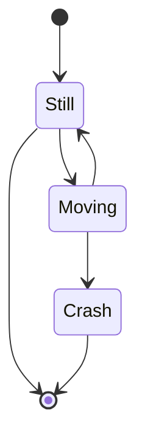
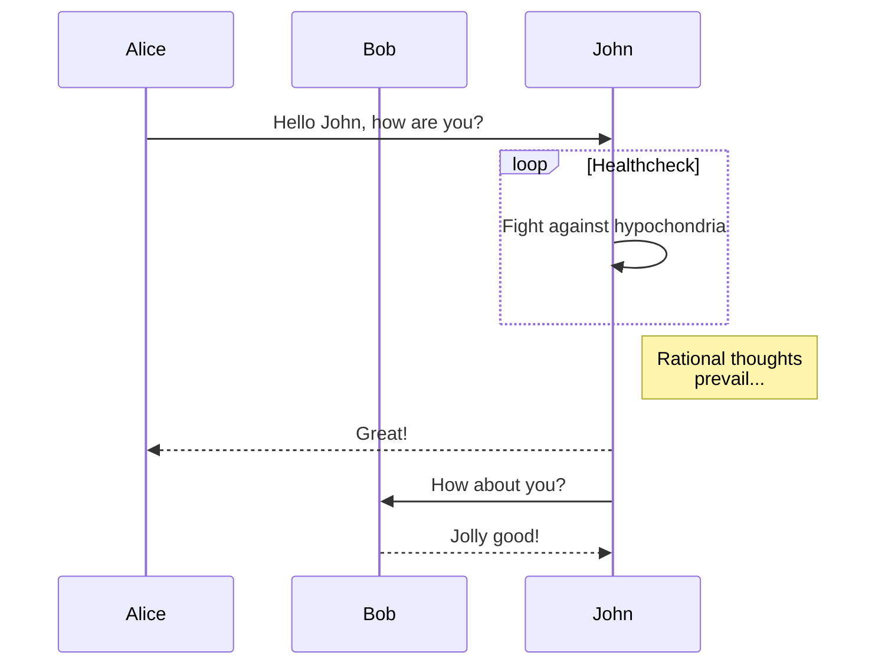

# Markdown

## Текст, абзацы и заголовки

Абзацы создаются при помощи пустой строки. Если вокруг текста сверху и снизу есть пустые строки, то текст превращается в абзац.

Чтобы сделать перенос строки вместо абзаца,  
нужно поставить два пробела в конце предыдущей строки.

Заголовки отмечаются диезом `#` в начале строки, от одного до шести. Например:

# Заголовок первого уровня #
## Заголовок h2
### Заголовок h3
#### Заголовок h4
##### Заголовок h5
###### Заголовок h6

## Курсив и жирный шрифт

Выделять слова можно при помощи `*` и `_`. Одним символ для наклонного текста, два символа для жирного текста, три — для наклонного и жирного одновременно.

Например, это _italic_ и это тоже *italic*. А вот так уже __strong__, и так тоже **strong**. А так ***жирный и наклонный*** одновременно.

## Зачеркивание и выделение

Две тильды `~` до и после текста.

~~Зачеркнуто~~

Два `=` до и после текста.

==Выделение==

## Списки

Для разметки неупорядоченных списков можно использовать или `*`, или `-`, или `+`:

- элемент 1
- элемент 2
- элемент ...

Вложенные пункты создаются четырьмя пробелами перед маркером пункта:

* элемент 1
* элемент 2
    * вложенный элемент 2.1
    * вложенный элемент 2.2
* элемент ...

Упорядоченный список:

1. элемент 1
2. элемент 2
    1. вложенный
    2. вложенный
3. элемент 3
4. Donec sit amet nisl. Aliquam semper ipsum sit amet velit. Suspendisse id sem consectetuer libero luctus adipiscing.

На самом деле не важно как в коде пронумерованы пункты, главное, чтобы перед элементом списка стояла цифра (любая) с точкой. Можно сделать и так:

0. элемент 1
0. элемент 2
0. элемент 3
0. элемент 4

Список с абзацами:

* Раз абзац. Lorem ipsum dolor sit amet, consectetur adipisicing elit.

* Два абзац. Donec sit amet nisl. Aliquam semper ipsum sit amet velit. Suspendisse id sem consectetuer libero luctus adipiscing.

* Три абзац. Ea, quis, alias nobis porro quos laborum minus sed fuga odio dolore natus quas cum enim necessitatibus magni provident non saepe sequi?

    Четыре абзац (Четыре пробела в начале или один tab).

## Цитаты

Цитаты оформляются как в электронной почте, с помощью символа `>`.

> This is a blockquote with two paragraphs. Lorem ipsum dolor sit amet,
> consectetuer adipiscing elit. Aliquam hendrerit mi posuere lectus.
> Vestibulum enim wisi, viverra nec, fringilla in, laoreet vitae, risus.
>
> Donec sit amet nisl. Aliquam semper ipsum sit amet velit. Suspendisse
> id sem consectetuer libero luctus adipiscing.

Или ленивым способом, когда знак `>` ставится перед каждым элементом цитаты, будь то абзац, заголовок или пустая строка:

> This is a blockquote with two paragraphs. Lorem ipsum dolor sit amet,
consectetuer adipiscing elit. Aliquam hendrerit mi posuere lectus.
Vestibulum enim wisi, viverra nec, fringilla in, laoreet vitae, risus.
>
> Donec sit amet nisl. Aliquam semper ipsum sit amet velit. Suspendisse
id sem consectetuer libero luctus adipiscing.

В цитаты можно помещать всё что угодно, в том числе вложенные цитаты:

> ## This is a header.
>
> 1.   This is the first list item.
> 2.   This is the second list item.
>
> > Вложенная цитата.
>
> Here's some example code:
>
>     return shell_exec("echo $input | $markdown_script");

## Горизонтальная черта

Cоздается тремя звездочками или тремя дефисами.

***

## Формулы

Это формула в строке: $x^2 + y^2 = z^2$. А это отдельная формула:
$$
1 +  \frac{q^2}{(1-q)}+\frac{q^6}{(1-q)(1-q^2)}+\cdots =
        \prod_{j=0}^{\infty}\frac{1}{(1-q^{5j+2})(1-q^{5j+3})},
         \quad\quad \text{for $|q| < 1$}.
$$
При записи формул используется язык $\LaTeX$.  Формулы можно нарисовать в [онлайн-редакторе](https://www.hostmath.com/).

Химические реакции и формулы
$$
\ce{Hg^2+ ->[I-]  $\underset{\mathrm{red}}{\ce{HgI2}}$  ->[I-] $\underset{\mathrm{red}}{\ce{[Hg^{II}I4]^2-}}$}
$$

## Таблицы

First Header  | Second Header
------------- | -------------
Content Cell  | Content Cell
Content Cell  | Content Cell

Для красоты можно и по бокам линии нарисовать:

| First Header  | Second Header |
| ------------- | ------------- |
| Content Cell  | Content Cell  |
| Content Cell  | Content Cell  |

Можно управлять выравниванием столбцов при помощи двоеточия.

| Left-Aligned  | Center Aligned  | Right Aligned |
|:------------- |:---------------:| -------------:|
| col 3 is      | some wordy text |     **$1600** |
| col 2 is      | centered        |         $12   |
| zebra stripes | are neat        |        ~~$1~~ |

Внутри таблиц можно использовать ссылки, наклонный, жирный или зачеркнутый текст.

## Комментарии

%%
Текст комментария
%%

Текст, заключенный в `%%` не виден в просмотре, но есть в исходном тексте.

```md
%%
Текст комментария
%%

Текст, заключенный в `%%` не виден в просмотре, но есть в исходном тексте.
```

## Исходный код

Cтавим по три апострофа (на букве Ё) до и после кода. Также можно указать язык исходного кода.

```html
<nav class="nav nav-primary">
  <ul>
    <li class="tab-conversation active">
      <a href="#" data-role="post-count" class="publisher-nav-color" data-nav="conversation">
        <span class="comment-count">0 комментариев</span>
        <span class="comment-count-placeholder">Комментарии</span>
      </a>
    </li>
    <li class="dropdown user-menu" data-role="logout">
      <a href="#" class="dropdown-toggle" data-toggle="dropdown">
        <span class="dropdown-toggle-wrapper">
          <span>
            Войти
          </span>
        </span>
        <span class="caret"></span>
      </a>
    </li>
  </ul>
</nav>
```

В коде не нужно заменять угловые скобки `< >` и амперсанд `&` на их html-сущности.

## Инлайн код

Для вставки кода внутри предложений нужно заключать этот код в апострофы (на букве Ё). Пример: `<html class="ie no-js">`.

Если внутри кода есть апостроф, то код надо обрамить двойными апострофами: ``There is a literal backtick (`) here.``

## Ссылки

 - Cамый простой вариант, автоматическая ссылка - http://obsidian.md
 - Cсылка с названием - [Википедия](https://www.wikipedia.org/)
 - Ссылка на другую заметку в этой базе: [[README]]
 - Она же, но с другим названием: [ЧАВО](README.md)
 - Ссылка на определенную секцию: [[README#Добавление материалов в базу]]

## Картинки

Картинка

![[mgo-cubik.png]]

Картинка с заданным размером (50 пикселей в ширину):

![[nanoparticle.png|50]]

Картинка с заданным размером (400x200 пикселей):

![[nanoparticle.png|400x200]]

## Задачи
- [x] поддерживаются #tags, [ссылки](), **форматирование**
- [x] используется синтаксис списка (поддерживаются упорядоченный или не упорядоченный списки)
- [x] это выполненная задача
- [?] это тоже выполненная задача (работает с любым символом)
- [ ] это не выполненная задача
- [ ] задачи в области предварительного просмотра помечаются выполненными при нажатии на чекбокс

## Диаграммы

Obsidian использует библиотеку [Mermaid](https://mermaid-js.github.io/) для отображения диаграмм и схем. У Mermaid есть удобный [«живой редактор»](https://mermaid-js.github.io/mermaid-live-editor).

Пример диаграммы состояний автомата:



Диаграмма коммуникаций:



## Сноски
Пример простой сноски[^1] и пример сноски подлиннее[^большая_сноска].

[^1]: со смыслом!
[^большая_сноска]: с несколькими абзацами и кодом.
		Делайте отступ перед абзацем, чтобы включить его в сноску.

Сноски также можно оставлять прямо в тексте.^[обратите внимание, что карет `^` при этом выносится за скобки.]

